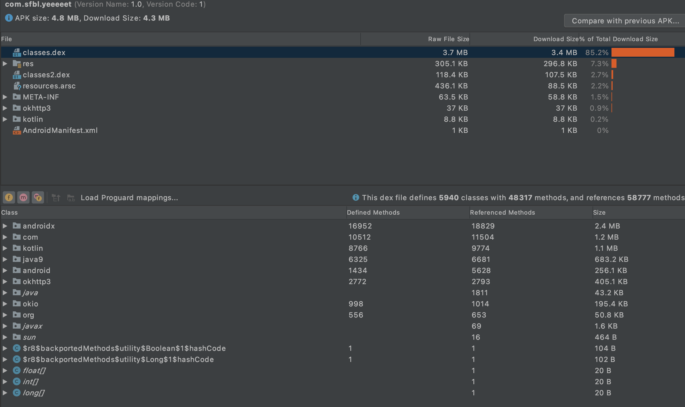
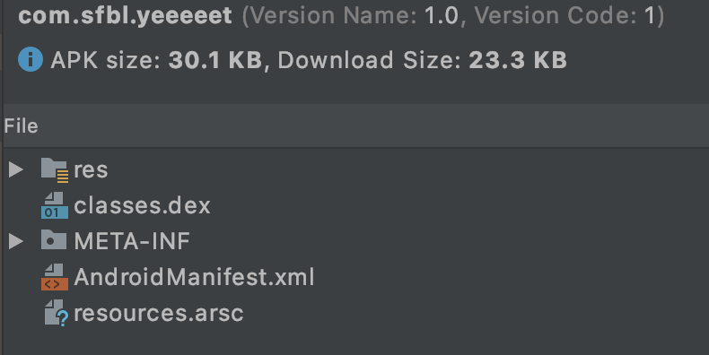

## Android optimize journey

This is how I optimize my Android app from `4.3 MB` to `23.3 KB` in size.

### I'm gonna to make Yeeeeet

Yeeeeet is an Android application which allow user to download Instagram photos, videos to their smartphone by sharing Instagram posts to it.

So basically, Yeeeeet need a method to get a metadata (json) from Instagram, JSON parser and method to download file to store the media in storage.

To download metadata from Instagram, I use AsyncHttpClient class as below:  
```java
import com.koushikdutta.async.http.AsyncHttpClient;
import com.koushikdutta.async.http.AsyncHttpGet;
import com.koushikdutta.async.http.AsyncHttpResponse;
```

To parse JSON string, I use Gson:
```java
import com.google.gson.Gson;
import com.google.gson.JsonArray;
import com.google.gson.JsonObject;
```

To download & store media files, I use Ion:
```java
import com.koushikdutta.ion.Ion;
```

This is a build.gradle file. TBO, I don't care much about these implementation lines (just copy from another project), so I can code my app as quick as possible:
```
dependencies {
    implementation 'org.slf4j:slf4j-simple:1.7.24'
    implementation 'com.google.code.gson:gson:2.8.5'
    implementation 'androidx.appcompat:appcompat:1.2.0'
    implementation 'com.google.android.material:material:1.2.1'
    implementation 'androidx.constraintlayout:constraintlayout:2.0.4'
    implementation 'com.github.ThinhVu:javaext:1.0.4'
    implementation("com.squareup.okhttp3:okhttp:4.9.3")
    compile 'com.koushikdutta.ion:ion:3.1.0'
}
```

You can find the source for this application at [here](https://github.com/ThinhVu/Yeeeeet).

---

As a lazy developer, I installed the Debug version of Yeeeeet to my phone using Android Studio debugger.

My phone storage have almost 64 GB of ROM, so I don't care about storage much.

But one time, when starring over my installed apps, I see there is a problem. 

```
Yeeeeet have approx ~14 MB in size.
```

**Why? What?** 

Why app size is so large? It only has more than 100 lines of code.

What is the problem?

### APK analyzer

First thing first, I need to see what's inside the Apk.

`./gradlew app:assembleDebug`, then double click to the app-debug.apk in /debug folder.



I don't know why the app took 14 MB in size (maybe it included Android Studio's junk code: breakpoints, etc, ... )

The APK size is 4.3 MB in size as image below (corresponding to [this commit](https://github.com/ThinhVu/Yeeeeet/commit/17c9e09566ace0689b7c34c112110e32396a4efc))

As you can see, there is a lot of things included in the APK (androidx, kotlin, java9, okhttp3, okio,...)

It's seem like an apk included everything in the libs, even the one it doesn't use. So I think it's time to remove unused stuff (code, resources, ...)

### Enable Proguard

```
debug {
    shrinkResources true
    minifyEnabled true
    proguardFiles getDefaultProguardFile('proguard-android-optimize.txt'), 'proguard-rules.pro'
}
```

then assembleDebug again.

Now the apk look like that:


The app size decreased by half in size in just one step. Excellent. But still large.

People can land on the Moon with 4 KB in RAM, approximately 64 KB in ROM.
With the current size of my app, it must land people on Mars, not just download a few Instagram pictures.

It means I have to do something to decrease the size furthermore.

### Using Android supported class instead of libraries

- remove `Gson`, using `org.json` for JSON parsing.
- remove `AsyncHttpClient` & `Ion`, using `HttpURLConnection` to download Instagram metadata and media resources.
- remove `androidx` stuff (which cost approximately 1.2 MB in size), just using components in android package for User interface.
- remove all resources (icon, themes), just keep the largest icon, so it can be used on any devices. 

You can see the commit at [here](https://github.com/ThinhVu/Yeeeeet/commit/5e69e9b1d692cb7719f1223920cfb3ebecba2fac)

then assemble the debug apk again. This is the result:



Now I'm happy with it.


